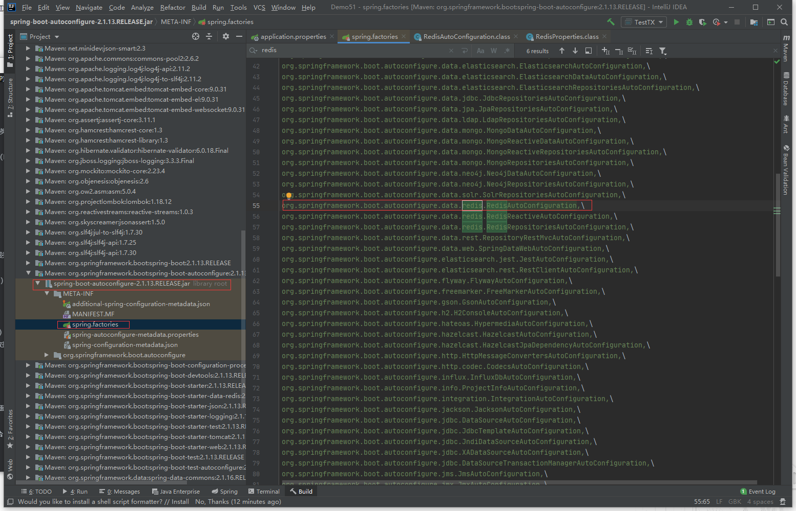

# 3. Redis的事务和SpringBoot整合

## 3.1 事务

ACID：原子性，一致性，隔离性，持久性


Redis 事务的本质：一组命令的集合！一个事务中的所有命令都会被序列化，在事务执行过程中，会按照顺序执行。

一次性、顺序性、排他性的执行一组命令。

Redis 事务没有隔离级别的概念。

所有的命令在事务中，并没有直接被执行，只有发起执行命令的时候才会执行（exec）。

Redis 单条命令是保证原子性的，但是事务不保证原子性。

Redis 事务的命令：

- 开启事务：multi
- 命令入队
- 执行事务：exec
- 撤销事务：discard

### 3.1.1 正常执行事务

~~~shell
127.0.0.1:6379> multi		# 开启事务
OK
127.0.0.1:6379> set k1 v1
QUEUED
127.0.0.1:6379> set k2 v2
QUEUED
127.0.0.1:6379> get k2
QUEUED
127.0.0.1:6379> set k3 v3
QUEUED
127.0.0.1:6379> exec			# 执行事务
1) OK
2) OK
3) "v2"
4) OK
127.0.0.1:6379> 
~~~

### 3.1.2 放弃事务

~~~shell
127.0.0.1:6379> multi
OK
127.0.0.1:6379> set m1 n1
QUEUED
127.0.0.1:6379> set m2 n2
QUEUED
127.0.0.1:6379> DISCARD		# 放弃事务
OK
127.0.0.1:6379> get m1		# 事务队列中命令都不会被执行
(nil)
~~~

> 编译型异常：命令有错，事务中所有的命令都不会被执行

~~~shell
127.0.0.1:6379> multi
OK
127.0.0.1:6379> set k1 v1
QUEUED
127.0.0.1:6379> set k2 v2
QUEUED
127.0.0.1:6379> setget k3 v3		# 错误的命令
(error) ERR unknown command `setget`, with args beginning with: `k3`, `v3`, 
127.0.0.1:6379> set k4 v4
QUEUED
127.0.0.1:6379> exec		# 执行事务报错
(error) EXECABORT Transaction discarded because of previous errors.
127.0.0.1:6379> get k4		# 所有的命令都不会被执行
(nil)
127.0.0.1:6379> 
~~~

> 运行时异常：如果事务中某条命令执行结果报错，其他命令是可以正常执行的，错误命令抛出异常

~~~shell
127.0.0.1:6379> set k1 "v1"
OK
127.0.0.1:6379> multi
OK
127.0.0.1:6379> incr k1		# 会执行失败
QUEUED
127.0.0.1:6379> set k2 v2
QUEUED
127.0.0.1:6379> set k3 v3
QUEUED
127.0.0.1:6379> get k3
QUEUED
127.0.0.1:6379> exec
1) (error) ERR value is not an integer or out of range		# 第一条命令执行失败，其余的正常执行
2) OK
3) OK
4) "v3"
127.0.0.1:6379> get k2
"v2"
127.0.0.1:6379> 
~~~

### 3.1.3 监视 Watch （面试常问）

悲观锁：很悲观，认为什么时候都会出问题，无论什么都会加锁。影响效率，实际情况一般会使用乐观锁。

乐观锁：很乐观，认为什么时候都不会出现问题，所以不上锁。更新数据的时候会判断一下，在此期间是否修改过监视的数据。

首先要了解redis事务中watch的作用，watch命令可以监控一个或多个key，一旦其中有一个key被修改（或删除），之后的事务就不会执行。监控一直持续到exec命令（事务中的命令是在exec之后才执行的，所以在multi命令后可以修改watch监控的键值）。假设我们通过watch命令在事务执行之前监控了多个Keys，倘若在watch之后有任何Key的值发生了变化，exec命令执行的事务都将被放弃，同时返回Null multi-bulk应答以通知调用者事务执行失败。

所以，需要注意的是watch监控键之后，再去操作这些键，否则watch可能会起不到效果。

> Redis 监视测试

正常测试：

```bash
127.0.0.1:6379> set money 100		
OK
127.0.0.1:6379> set out 0
OK
127.0.0.1:6379> watch money		# 监视 money 对象
OK
127.0.0.1:6379> multi		# 事务正常结束，执行期间，money 没有变动，这个时候就能执行成功了
OK
127.0.0.1:6379> DECRBY money 20
QUEUED
127.0.0.1:6379> INCRBY out 20
QUEUED
127.0.0.1:6379> exec
1) (integer) 80
2) (integer) 20
127.0.0.1:6379> 
```

测试多线程修改值，使用 watch 可以当做 Redis 的乐观锁操作。

```bash
127.0.0.1:6379> set money 100
OK
127.0.0.1:6379> set out 10
OK
127.0.0.1:6379> watch money	# 监视 money
OK
127.0.0.1:6379> multi
OK
127.0.0.1:6379> DECRBY money 10
QUEUED
127.0.0.1:6379> DECRBY out 10
QUEUED
127.0.0.1:6379> exec		# 执行之前，在另外一个线程 B 中修改 money 的值，下面就是执行失败。
(nil)
127.0.0.1:6379> 
```

B 线程：

```bash
[root@coder bin]# redis-cli -p 6379
127.0.0.1:6379> set money 30
OK
```

如果修改失败，获取最新的值就好。

```bash
127.0.0.1:6379> UNWATCH		# 事务执行失败，先解锁
OK
127.0.0.1:6379> WATCH money		# 获取最新的值，再次监视。相当于 MySQL 中的 select version
OK
127.0.0.1:6379> multi
OK
127.0.0.1:6379> DECRBY money 1
QUEUED
127.0.0.1:6379> INCRBY out 1
QUEUED
127.0.0.1:6379> exec		# 执行的时候会对比监视的值，如果发生变化会执行失败。
1) (integer) 29
2) (integer) 11
127.0.0.1:6379> 
```

## 3.2 Jedis

使用 Java 操作 Redis 。Jedis 是 Redis 官方推荐的Java 开发工具，是 Java 操作 Redis 的中间件。

1、导入依赖

```xml
<dependencies>
    <!-- jeids -->
    <!-- https://mvnrepository.com/artifact/redis.clients/jedis -->
    <dependency>
        <groupId>redis.clients</groupId>
        <artifactId>jedis</artifactId>
        <version>3.2.0</version>
    </dependency>

    <!-- fastjson -->
    <!-- https://mvnrepository.com/artifact/com.alibaba/fastjson -->
    <dependency>
        <groupId>com.alibaba</groupId>
        <artifactId>fastjson</artifactId>
        <version>1.2.68</version>
    </dependency>
</dependencies>
```

2、测试：启动本地 Windows 版本的 Redis

```java
package com.xiaopizhu;

import redis.clients.jedis.Jedis;

public class TestPing {
    public static void main(String[] args) {
        Jedis jedis = new Jedis("localhost", 6379, 10);
        System.out.println(jedis.ping()); // PONG
    }
}
```

> 事务

```java
package com.xiaopizhu;

import com.alibaba.fastjson.JSONObject;
import redis.clients.jedis.Jedis;
import redis.clients.jedis.Transaction;

/**
 * 测试事务
 */
public class TestTX {
    public static void main(String[] args) {
        Jedis jedis = new Jedis("localhost", 6379);
        jedis.flushDB();
        JSONObject jsonObject = new JSONObject();
        jsonObject.put("hello", "world");
        jsonObject.put("name", "xxx");

        // 开启事务
        Transaction multi = jedis.multi();
        String result = jsonObject.toJSONString();

        try {
            multi.set("user1", result);
            multi.set("user2", result);
            int i = 1 / 0; // 模拟异常
            multi.exec(); // 执行事务
        } catch (Exception e) {
            multi.discard(); // 放弃事务
            e.printStackTrace();
        } finally {
            System.out.println(jedis.get("user1")); // 正常执行时{"name":"xxx","hello":"world"}   // null
            System.out.println(jedis.get("user2"));
            jedis.close(); // 关闭链接
        }
    }
}
```

## 3.3 SpringBoot整合

Spring Data 也是和 Spring Boot 齐名的项目。

说明：在 Spring Boot 2.x 之后，原来的 Jedis 被替换为了 lettuce。

Jedis：采用的直连，多线程操作的话是不安全的，如果想要避免不安全的话，使用 Jedis Pool ，更像 BIO 模式。

lettuce ：采用 netty ，实例可以在多个线程中共享，不存在线程不安全的情况，可以减少线程连接，更像 NIO 模式。

~~~shell
# Spring Boot 所有的配置类，都有一个自动配置类  RedisTemplate
# 自动配置类都会绑定一个 properties 配置文件。  RedisProperties
~~~

阅读源码：



```java
@Configuration
@ConditionalOnClass({RedisOperations.class})
@EnableConfigurationProperties({RedisProperties.class})
@Import({LettuceConnectionConfiguration.class, JedisConnectionConfiguration.class})
public class RedisAutoConfiguration {
    public RedisAutoConfiguration() {
    }

    @Bean
    @ConditionalOnMissingBean(
        name = {"redisTemplate"}
    ) // 我们可以自己定义一个 RedisTemplate 来替换这个默认的。
    public RedisTemplate<Object, Object> redisTemplate(RedisConnectionFactory redisConnectionFactory) throws UnknownHostException {
        // 默认的 RedisTemplate 没有过多的设置， Redis 对象都是需要序列化的。
        // 两个泛型都是 Object, Object 的类型，我们需要强制装换为 <String, Obejct>
        RedisTemplate<Object, Object> template = new RedisTemplate();
        template.setConnectionFactory(redisConnectionFactory);
        return template;
    }

    @Bean
    @ConditionalOnMissingBean // 由于 String 类型是 Redis 中最常用的，所以单独提出来一个 bean .
    public StringRedisTemplate stringRedisTemplate(RedisConnectionFactory redisConnectionFactory) throws UnknownHostException {
        StringRedisTemplate template = new StringRedisTemplate();
        template.setConnectionFactory(redisConnectionFactory);
        return template;
    }
}
```

测试一下：

1、导入依赖：

```xml
<dependency>
    <groupId>org.springframework.boot</groupId>
    <artifactId>spring-boot-starter-data-redis</artifactId>
</dependency>
```

2、配置连接

```properties
# 配置 Redis
spring.redis.host=127.0.0.1
spring.redis.port=6379
```

3、测试

```java
package com.xiaopizhu;

import org.junit.Test;
import org.junit.runner.RunWith;
import org.springframework.beans.factory.annotation.Autowired;
import org.springframework.boot.test.context.SpringBootTest;
import org.springframework.data.redis.core.RedisTemplate;
import org.springframework.test.context.junit4.SpringRunner;

@RunWith(SpringRunner.class)
@SpringBootTest
public class Redis02SpringbootApplicationTests {

    @Autowired
    private RedisTemplate redisTemplate;

    @Test
    public void contextLoads() {
        // 除了基本的操作，我们常用的方法都可以直接通过 redisTemplate 操作，比如事务和 CRUD
        redisTemplate.opsForValue().set("name", "xiaoming");
        System.out.println(redisTemplate.opsForValue().get("name")); // xiaoming
    }
}
```

看一下源码：RedisTemplate.class

```java
// 序列化配置
@Nullable
private RedisSerializer keySerializer = null;
@Nullable
private RedisSerializer valueSerializer = null;
@Nullable
private RedisSerializer hashKeySerializer = null;
@Nullable
private RedisSerializer hashValueSerializer = null;
private RedisSerializer<String> stringSerializer = RedisSerializer.string();
public void afterPropertiesSet() {
    super.afterPropertiesSet();
    boolean defaultUsed = false;
    if (this.defaultSerializer == null) {
        // 默认使用了 JDK 的序列化，会使得字符串转义
        this.defaultSerializer = new JdkSerializationRedisSerializer(this.classLoader != null ? this.classLoader : this.getClass().getClassLoader());
    }

    // ...
}
```

我们使用 Json 序列化，所以需要自定义配置类

### 3.3.1 序列化

编写一个实体类 User，测试序列化。

```java
package com.xiaopizhu.pojo;

import lombok.AllArgsConstructor;
import lombok.Data;
import lombok.NoArgsConstructor;
import org.springframework.stereotype.Component;

@Component
@NoArgsConstructor
@AllArgsConstructor
@Data
public class User {
    private String name;
    private int age;
}
```

测试序列化：

```java
 @Test
public void test() throws JsonProcessingException {
    User user = new User("xiaoming", 3);
    redisTemplate.opsForValue().set("user", user);
    System.out.println(redisTemplate.opsForValue().get("user"));
}
```

抛出异常：

```bash
Caused by: java.lang.IllegalArgumentException: DefaultSerializer requires a Serializable payload but received an object of type [com.xiaopizhu.pojo.User]
	at org.springframework.core.serializer.DefaultSerializer.serialize(DefaultSerializer.java:43)
	at org.springframework.core.serializer.support.SerializingConverter.convert(SerializingConverter.java:63)
	... 35 more
```

`DefaultSerializer requires a Serializable`默认的序列化需要实体类实现序列化接口。所以修改 User：

```java
public class User implements Serializable {
    private String name;
    private int age;
}
```

结果：

```java
User(name=xiaoming, age=3)
```

结果显示正常，但是控制台还是转义的。

```bash
127.0.0.1:6379> keys *
1) "\xac\xed\x00\x05t\x00\x04user"
127.0.0.1:6379>
```

使用 jackson 的序列化：

```java
@Test
public void test() throws JsonProcessingException {
    // 一般开发中都会使用 json 来传递对象
    User user = new User("xiaoming", 3);
    String jsonUser = new ObjectMapper().writeValueAsString(user);
    redisTemplate.opsForValue().set("user", jsonUser);
    System.out.println(redisTemplate.opsForValue().get("user")); // {"name":"xiaoming","age":3}
}
```

无论 User 是否实现了 Serializable 接口，控制台结果显示正常，但是客户端中查看还是被转义了。

如果不想使用 JDK 的序列化，可以自己编写 RedisTemplate。

### 3.3.2 自定义RedisTemplate

```java
package com.xiaopizhu.config;

import com.fasterxml.jackson.annotation.JsonAutoDetect;
import com.fasterxml.jackson.annotation.PropertyAccessor;
import com.fasterxml.jackson.databind.ObjectMapper;
import org.springframework.context.annotation.Bean;
import org.springframework.context.annotation.Configuration;
import org.springframework.data.redis.connection.RedisConnectionFactory;
import org.springframework.data.redis.core.RedisTemplate;
import org.springframework.data.redis.serializer.Jackson2JsonRedisSerializer;
import org.springframework.data.redis.serializer.StringRedisSerializer;

/**
 * 编写的自己的 RedisTemplate
 */
@Configuration
public class RedisConfig {

    @Bean
    @SuppressWarnings("all")
    public RedisTemplate<String, Object> redisTemplate(RedisConnectionFactory redisConnectionFactory) {
        // 为了开发方便，一般使用 <String, Object>
        RedisTemplate<String, Object> template = new RedisTemplate();
        template.setConnectionFactory(redisConnectionFactory);

        // 序列化配置
        Jackson2JsonRedisSerializer<Object> jackson2JsonRedisSerializer = new Jackson2JsonRedisSerializer(Object.class);
        ObjectMapper om = new ObjectMapper();
        om.setVisibility(PropertyAccessor.ALL, JsonAutoDetect.Visibility.ANY);
        om.enableDefaultTyping(ObjectMapper.DefaultTyping.NON_FINAL);
        jackson2JsonRedisSerializer.setObjectMapper(om);

        // String 的序列化
        StringRedisSerializer stringRedisSerializer = new StringRedisSerializer();
        // key 采用 String 的序列化方式
        template.setKeySerializer(stringRedisSerializer);
        // hash 的 key 也采用 String 的序列化方式
        template.setHashKeySerializer(stringRedisSerializer);
        // value 序列化方式采用 Jackson
        template.setValueSerializer(jackson2JsonRedisSerializer);
        // hash 的 value 序列化方式采用 Jackson
        template.setHashKeySerializer(jackson2JsonRedisSerializer);
        template.afterPropertiesSet();

        return template;
    }
}
```

注入和测试：

```java
@Autowired
@Qualifier("redisTemplate")
private RedisTemplate redisTemplate;

@Test
public void test() throws JsonProcessingException {
    // 一般开发中都会使用 json 来传递对象
    User user = new User("xiaoming", 3);
    String jsonUser = new ObjectMapper().writeValueAsString(user);
    redisTemplate.opsForValue().set("user", jsonUser);
    System.out.println(redisTemplate.opsForValue().get("user")); // {"name":"xiaoming","age":3}
}
```

客户端中查看：

```bash
127.0.0.1:6379> keys *
1) "user"
127.0.0.1:6379>
```

这个时候的对象就没有被转义。

或者直接使用 RedisTemplate<String,String> 或者 StringRedisTemplate 即可。