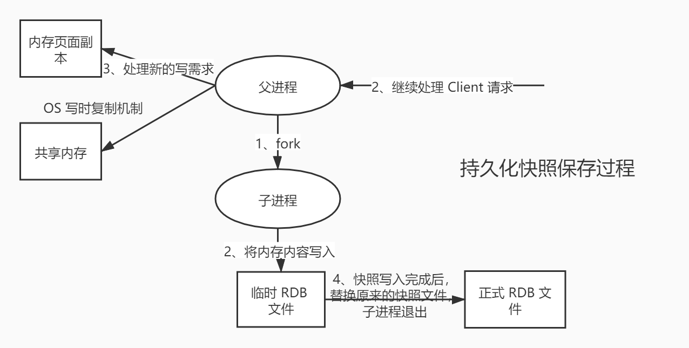

# 4. Redis配置文件和持久化

## 4.1 Redis.conf详解

找到启动时指定的配置文件：

```bash
[root@coder ~]# cd /usr/local/bin
[root@coder bin]# ls
dump.rdb         jemalloc.sh  redis-config           luajit        mcrypt    redis-benchmark  redis-check-rdb  redis-sentinel
jemalloc-config  jeprof       libmcrypt-config  luajit-2.0.4  mdecrypt  redis-check-aof  redis-cli        redis-server
[root@coder bin]# cd redis-config/
[root@coder redis-config]# vim redis.conf 
```

### 4.1.1 单位

```bash
# Redis configuration file example.
#
# Note that in order to read the configuration file, Redis must be
# started with the file path as first argument:
#
# ./redis-server /path/to/redis.conf

# Note on units: when memory size is needed, it is possible to specify
# it in the usual form of 1k 5GB 4M and so forth:
#
# 1k => 1000 bytes
# 1kb => 1024 bytes
# 1m => 1000000 bytes
# 1mb => 1024*1024 bytes
# 1g => 1000000000 bytes
# 1gb => 1024*1024*1024 bytes
#
# units are case insensitive so 1GB 1Gb 1gB are all the same.
```

配置文件中 unit 单位对大小写不敏感。

### 4.1.2 包含

```bash
################################## INCLUDES ###################################

# Include one or more other config files here.  This is useful if you
# have a standard template that goes to all Redis servers but also need
# to customize a few per-server settings.  Include files can include
# other files, so use this wisely.
#
# Notice option "include" won't be rewritten by command "CONFIG REWRITE"
# from admin or Redis Sentinel. Since Redis always uses the last processed
# line as value of a configuration directive, you'd better put includes
# at the beginning of this file to avoid overwriting config change at runtime.
#
# If instead you are interested in using includes to override configuration
# options, it is better to use include as the last line.
#
# include /path/to/local.conf
# include /path/to/other.conf
```

配置文件可以将多个配置文件合起来使用。

### 4.1.3 NETWORK 网络

~~~bash
bind 127.0.0.1		# 绑定的 IP 只有127.0.0.1 可以访问redis服务，0.0.0.0 代表所有的ip都可以访问
protected-mode no   # 保护模式
port 6379			# 端口设置
~~~

### 4.1.4 GENERAL 通用

~~~bash
daemonize yes		# 以守护进程的方式运行，默认是 no ，我们需要自己开启为 yes
pidfile /var/run/redis_6379.pid		#  如果是后台启动，我们需要指定一个pid 文件

# 日志级别
# Specify the server verbosity level.
# This can be one of:
# debug (a lot of information, useful for development/testing)
# verbose (many rarely useful info, but not a mess like the debug level)
# notice (moderately verbose, what you want in production probably)
# warning (only very important / critical messages are logged)
loglevel notice
logfile ""		# 日志文件的位置
databases 16	# 数据库的数量，默认是 16
always-show-logo yes  # 是否总是显示 LOGO
~~~

### 4.1.5 快照 SNAPSHOTTING

持久化，在规定的时间内，执行了多少次操作则会持久化到文件

Redis 是内存数据库，如果没有持久化，那么数据断电即失。

```bash
################################ SNAPSHOTTING  ################################
#
# Save the DB on disk:
#
#   save <seconds> <changes>
#
#   Will save the DB if both the given number of seconds and the given
#   number of write operations against the DB occurred.
#
#   In the example below the behaviour will be to save:
#   after 900 sec (15 min) if at least 1 key changed
#   after 300 sec (5 min) if at least 10 keys changed
#   after 60 sec if at least 10000 keys changed
#
#   Note: you can disable saving completely by commenting out all "save" lines.
#
#   It is also possible to remove all the previously configured save
#   points by adding a save directive with a single empty string argument
#   like in the following example:
#
#   save ""
# 如果 900s 内，至少有 1 个 key 进行了修改，进行持久化操作
save 900 1

# 如果 300s 内，至少有 10 个 key 进行了修改，进行持久化操作
save 300 10
save 60 10000

stop-writes-on-bgsave-error yes  # 如果持久化出错，是否还要继续工作
rdbcompression yes    # 是否压缩 rdb 文件，需要消耗一些 cpu 资源
rdbchecksum yes # 保存 rdb 文件的时候，进行错误的检查校验
dir ./  # rdb 文件保存的目录
```

### 4.1.6 SECURITY 安全

可以设置 Redis 的密码，默认是没有密码的。

```bash
[root@coder bin]# redis-cli -p 6379
127.0.0.1:6379> ping
PONG
127.0.0.1:6379> config get requirepass		# 获取 redis 密码
1) "requirepass"
2) ""
127.0.0.1:6379> config set requirepass "123456"  # 设置 redis 密码
OK
127.0.0.1:6379> ping
(error) NOAUTH Authentication required.		# 发现所有的命令都没有权限了
127.0.0.1:6379> auth 123456			# 使用密码登录
OK
127.0.0.1:6379> config get requirepass
1) "requirepass"
2) "123456"
127.0.0.1:6379> 
```

### 4.1.7 CLIENTS 限制

~~~shell
################################### CLIENTS ####################################

# Set the max number of connected clients at the same time. By default
# this limit is set to 10000 clients, however if the Redis server is not
# able to configure the process file limit to allow for the specified limit
# the max number of allowed clients is set to the current file limit
# minus 32 (as Redis reserves a few file descriptors for internal uses).
#
# Once the limit is reached Redis will close all the new connections sending
# an error 'max number of clients reached'.
#
# maxclients 10000		# 设置能链接上 redis 的最大客户端数量
# maxmemory <bytes>		# redis 设置最大的内存容量
 maxmemory-policy noeviction  # 内存达到上限之后的处理策略
     - noeviction：当内存使用达到阈值的时候，所有引起申请内存的命令会报错。
    - allkeys-lru：在所有键中采用lru算法删除键，直到腾出足够内存为止。
    - volatile-lru：在设置了过期时间的键中采用lru算法删除键，直到腾出足够内存为止。
    - allkeys-random：在所有键中采用随机删除键，直到腾出足够内存为止。
    - volatile-random：在设置了过期时间的键中随机删除键，直到腾出足够内存为止。
    - volatile-ttl：在设置了过期时间的键空间中，具有更早过期时间的key优先移除。
~~~


### 4.1.8 APPEND ONLY 模式 AOF 配置

~~~bash
appendonly no  # 默认是不开启 AOF 模式的，默认使用 rdb 方式持久化，大部分情况下，rdb 完全够用

appendfilename "appendonly.aof"		# 持久化的文件的名字
# appendfsync always  # 每次修改都会 sync 消耗性能
appendfsync everysec  # 每秒执行一次 sync 可能会丢失这 1s 的数据。
# appendfsync no      # 不执行 sync 这个时候操作系统自己同步数据，速度最快。
~~~

## 4.2 持久化（面试和工作重点）

面试和工作，持久化都是重点。

Redis 是内存数据库，如果不将内存中的数据库状态保存到磁盘，那么一旦服务器进程退出，服务器中的数据库状态就会消失，所以 Redis 提供了持久化功能。

### 4.2.1 RDB (Redis DataBase)

> 什么是 RDB



在指定的时间间隔内，将内存中的数据集快照写入磁盘，也就是 Snapshot 快照，它恢复时是将快照文件直接读取到内存里的。

Redis 会单独创建（fork）一个子进程进行持久化，会先将数据写入一个临时文件中，待持久化过程结束了，再用这个临时文件替换上次持久化好的文件。整个过程中，主进程不进行任何 IO 操作，这就确保的极高的性能。如果需要大规模的数据的恢复，且对数据恢复的完整性不是非常敏感，那 RDB 方式要比 AOF 方式更加高效。RDB 唯一的缺点是最后一次持久化的数据可能会丢失。

生产环境下，需要对这个文件备份。

默认持久化方式是 RDB，一般不需要修改。

rdb 保存的文件是 dump.rdb ：

```bash
# The filename where to dump the DB
dbfilename dump.rdb
```

**测试1：**

首先修改配置文件保存快照的策略

```bash
################################ SNAPSHOTTING  ################################
#
# Save the DB on disk:
#
#   save <seconds> <changes>
#
#   save ""

# save 900 1
# save 300 10
# save 60 10000
save 60 5  # 只要 60s 内修改了 5 次 key 就会触发 rdb 操作。
```

保存配置文件：

```bash
127.0.0.1:6379> save
OK
127.0.0.1:6379> 
```

删除原始的 dump.rdb 文件：

```bash
[root@coder bin]# ls
dump.rdb         jemalloc.sh  redis-config           luajit        mcrypt    redis-benchmark  redis-check-rdb  redis-sentinel
jemalloc-config  jeprof       libmcrypt-config  luajit-2.0.4  mdecrypt  redis-check-aof  redis-cli        redis-server
[root@coder bin]# rm -rf dump.rdb 
[root@coder bin]# ls
jemalloc-config  jeprof   libmcrypt-config  luajit-2.0.4  mdecrypt         redis-check-aof  redis-cli       redis-server
jemalloc.sh      redis-config  luajit            mcrypt        redis-benchmark  redis-check-rdb  redis-sentinel
[root@coder bin]# 
```

60s 内修改 5 次 key ：

```bash
127.0.0.1:6379> set k1 v1
OK
127.0.0.1:6379> set k2 v2
OK
127.0.0.1:6379> set k3 v3
OK
127.0.0.1:6379> set k4 v4
OK
127.0.0.1:6379> set k5 v5
OK
```

dump.rdb 文件再次出现。

```bash
[root@coder bin]# ls
dump.rdb         jemalloc.sh  redis-config           luajit        mcrypt    redis-benchmark  redis-check-rdb  redis-sentinel
jemalloc-config  jeprof       libmcrypt-config  luajit-2.0.4  mdecrypt  redis-check-aof  redis-cli        redis-server
[root@coder bin]# 
```

恢复数据：

关闭 Redis 服务和客户端，再次进入时数据被自动恢复：

```bash
127.0.0.1:6379> shutdown		# 关闭 Redis 服务
not connected> exit
[root@coder bin]# ps -ef|grep redis		# redis 已经关闭了
root     25989 23576  0 14:27 pts/1    00:00:00 grep --color=auto redis
[root@coder bin]# redis-server redis-config/redis.conf 		# 再次开启服务
25994:C 02 May 2020 14:28:01.003 # oO0OoO0OoO0Oo Redis is starting oO0OoO0OoO0Oo
25994:C 02 May 2020 14:28:01.003 # Redis version=5.0.8, bits=64, commit=00000000, modified=0, pid=25994, just started
25994:C 02 May 2020 14:28:01.003 # Configuration loaded
[root@coder bin]# redis-cli -p 6379		# 客户端连接
127.0.0.1:6379> get k2						# 可以直接获取数据，说明k2 被持久化了。
"v2"
127.0.0.1:6379> 
```

------

save: 阻塞

bgsave: 非阻塞

**测试2：**

删除 dump.rdb 文件

```bash
root@coder bin]# rm -rf dump.rdb 
[root@coder bin]# ls
jemalloc-config  jeprof   libmcrypt-config  luajit-2.0.4  mdecrypt         redis-check-aof  redis-cli       redis-server
jemalloc.sh      redis-config  luajit 
```

在客户端清除所有数据：

```bash
127.0.0.1:6379> flushall
OK
```

再次检验 dump.rdb 文件：

```bash
[root@coder bin]# ls
dump.rdb         jemalloc.sh  redis-config           luajit        mcrypt    redis-benchmark  redis-check-rdb  redis-sentinel
jemalloc-config  jeprof       libmcrypt-config  luajit-2.0.4  mdecrypt  redis-check-aof  redis-cli        redis-server
[root@coder bin]# 
```

dump.rdb 文件再次出现。

> 触发机制

1、save 的规则满足的情况下，会自动触发 rdb 规则

2、执行 flushall 命令，也会触发 rdb 规则

3、退出 redis 也会产生 rdb 文件

备份就自动生成一个 dump.rdb 文件。

> 如何恢复 rdb 文件

1、只需要将 rdb 文件放在 Redis 启动目录就可以，Redis 启动的时候会自动检查 dump.rdb ，恢复其中的数据；

2、查看存放 rdb 文件的位置，在客户端中使用如下命令。

```bash
127.0.0.1:6379> config get dir
1) "dir"
2) "/usr/local/bin"  # 如果在这个目录下存在 dump.rdb 文件，启动就会自动恢复其中的数据
127.0.0.1:6379> 
```

> RDB 的优缺点

**优点：**

1、适合大规模的数据恢复

2、对数据的完整性要求不高

**缺点：**

1、需要一定的时间间隔进行操作，如果 Redis 意外宕机，最后一次修改的数据就没有了

2、fork 进程的时候，会占用一定的空间。

### 4.2.2 AOF（Append Only File）

AOF( append only file )持久化以独立日志的方式记录每次写命令，并在 Redis 重启时在重新执行 AOF 文件中的命令以达到恢复数据的目的。AOF 的主要作用是解决数据持久化的实时性。

以日志形式来记录每个操作，将 Redis 执行的过程的所有指令记录下来（读操作不记录），只追加文件但不可以改写文件，redis 启动之初会读取该文件重新构建数据，换言之，redis 重启的话就根据日志文件的内容将写指令从前到后执行一遍以完成数据的恢复工作。

AOF 保存的是 appendonly.aof 文件。

> 开启 AOF 模式

将配置文件中默认为 no 的 appendonly 修改为 yes ，重启服务。

```bash
appendonly yes
# The name of the append only file (default: "appendonly.aof")
appendfilename "appendonly.aof"
```

重启后可以看到 AOF 文件：

```bash
[root@coder bin]# ls
appendonly.aof 
```

但是文件是空的。使用客户端添加一些数据再次查看：

```bash
[root@coder bin]# redis-cli -p 6379
127.0.0.1:6379> set k1 v1
OK
127.0.0.1:6379> set k2 v2
OK
127.0.0.1:6379> set k3 v3
OK
127.0.0.1:6379> 
[root@coder bin]# cat appendonly.aof 
*2
$6
SELECT
$1
0
*3
$3
set
$2
k1
$2
v1
*3
$3
set
$2
k2
$2
v2
*3
$3
set
$2
k3
$2
v3
```

> 自动修复 AOF文件

如果手动修改AOF 文件，可能导致 Redis 服务不能启动。比如这里我手动在 AOF 文件的最后一行随便添加一些命令：

```bash
set
$2
k3
$2
v3
gjjjjjjjjj
```

删除 dump.rdb 文件，重启服务：

```bash
[root@coder bin]# rm -rf dump.rdb 
[root@coder bin]# ls
appendonly.aof  
[root@coder bin]# redis-server redis-config/redis.conf 
13746:C 02 May 2020 16:22:43.345 # oO0OoO0OoO0Oo Redis is starting oO0OoO0OoO0Oo
13746:C 02 May 2020 16:22:43.346 # Redis version=5.0.8, bits=64, commit=00000000, modified=0, pid=13746, just started
13746:C 02 May 2020 16:22:43.346 # Configuration loaded
[root@coder bin]# redis-cli -p 6379
Could not connect to Redis at 127.0.0.1:6379: Connection refused		# 连接失败
not connected>
```

如果这个 AOF 文件有错位，客户端就不能链接了，需要修复 AOF 文件。Redis 提供了工具 `redis-check-aof --fix`

```bash
[root@coder bin]# redis-check-aof --fix appendonly.aof 
0x              6e: Expected prefix '*', got: 'g'
AOF analyzed: size=122, ok_up_to=110, diff=12
This will shrink the AOF from 122 bytes, with 12 bytes, to 110 bytes
Continue? [y/N]: y
Successfully truncated AOF
[root@coder bin]# 
```

重启服务，再次尝试链接成功。

> AOF 的优缺点

```bash
appendonly yes		# 默认是 no
appendfilename "appendonly.aof"  # 持久化的文件的名字
# appendfsync always   # 每次修改都会 sync ，消耗性能
appendfsync everysec   # 每秒执行一次 sync ，可能会丢失这 1s 的数据
# appendfsync no       # 不执行 sync，这个时候操作系统自己同步数据，速度最快
```

**优点：**

1、每一次修改都同步，文件的完整性更加好

2、每秒同步一次，可能会丢失一秒的数据

3、从不同步，效率最高的

**缺点：**

1、相对于数据文件来说， AOF 远远大于 RDB ，修复的速度也比 RDB 慢

2、AOF 的运行效率也比 RDB 慢，所以 Redis 默认的配置就是 RDB 持久化。

问题：如果每次写命令 都保存 ， set  k1 v1   set k1 v2  set k1 v3 , 数据最终是v3 ，但是 每条命令都需要存储吗？ 如果存储，数据恢复的时候 每条命令执行，效率是不是有影响？

aof 有 重写功能，只会保留最后一条修改的命令。

### 4.2.3 拓展

1、RDB 持久化方式能够在指定的时间间隔内对你的数据进行快照存储

2、AOF 持久化方式记录每次对服务器写的操作，当服务器重启的时候会重新执行这些命令来恢复原始的数据，AOF 命令以Redis 协议追加保存每次写的操作到文件尾部，Redis 还能对 AOF 文件进性后台重写，使得AOF 文件的体积不至于过大（多次修改，只保留最后一次修改的命令）

3、只做缓存，如果你只希望你的数据在服务器运行的时候存在，你也可以不使用任何持久化

4、同时开启两种持久化方式

- 在这种情况下，当 Redis 重启的时候会优先加载AOF 文件来恢复原始的数据，因为在通常情况下，AOF 文件保存的数据集要比 RDB 文件保存的数据集要完整。
- RDB 的数据不实时，同步使用两者时服务器重启也只会找 AOF 文件。那要不要只使用 AOF 呢？作者建议不要，因为 RDB 更适合用于备份数据库（AOF 在不断变化不好备份），快速重启，而且不会有 AOF 可能潜在的 BUG，留着作为一个万一的手段。

5、性能建议

- 因为 RDB 文件只用作后备用途，建议只在 Slave 上持久化 RDB 文件，而且只要 15 分钟备份一次就够了，只保留save 900 1 这条规则。
- 如果 Enable AOF ，好处是在最恶劣情况下也只会丢失不超过两秒的数据，启动脚本较简单只 load 自己的 AOF 文件就可以了，代价是一是带来了持续的IO，二是 AOF rewrite 的最后将rewrite 过程中产生的新数据写到新文件造成的阻塞几乎是不可避免的。只要硬盘许可，应该尽量减少 AOF rewrite 的频率，AOF 重写的基础大小默认值是 64M 太小了，可以设置到 5G 以上，默认值超过原大小 100% 时重写，可以改到适当的数值。
- 如果不 Enable AOF ，仅靠 Master-Slave Repllcation 实现高可用也可以，能省掉一大笔 IO ，也减少了 rewrite 时带来的系统波动。代价是如果 Master/Slave 同时宕掉，会丢失十几分钟的数据，启动脚本也要比较两个 Master/Slave 中的 RDB 文件，载入较新的那个，微博就是这种架构