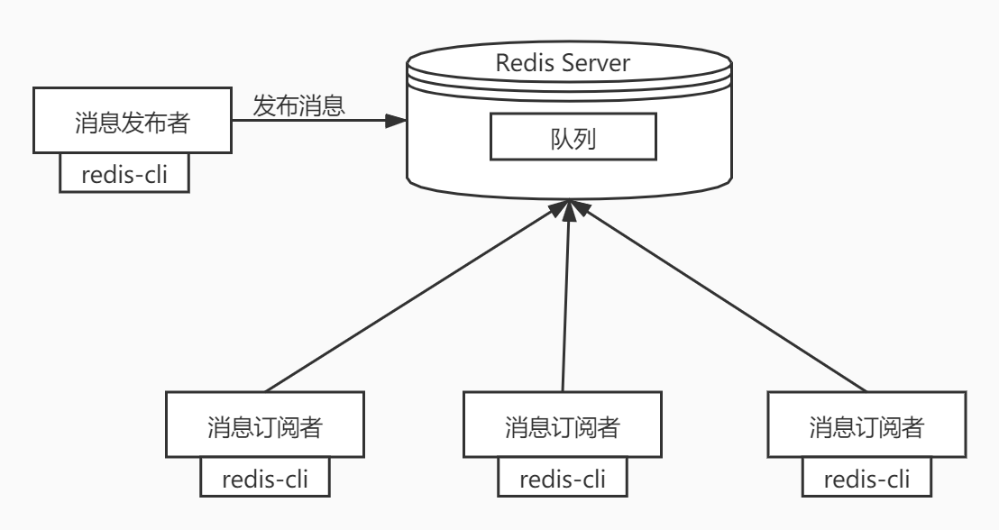
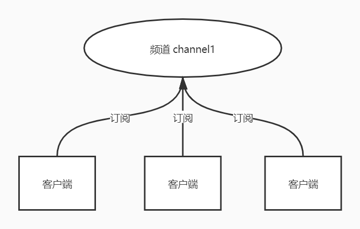
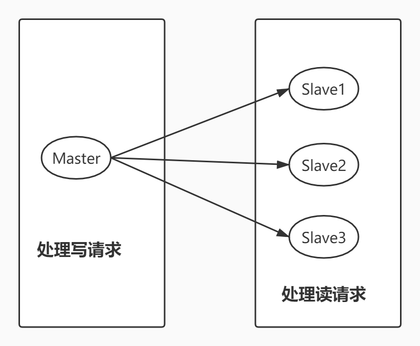
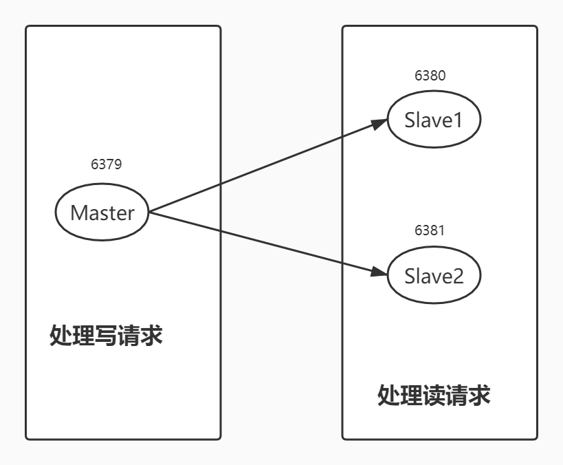
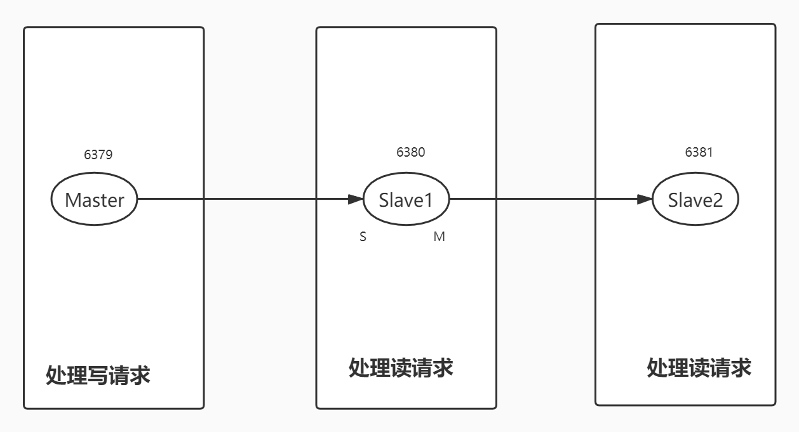
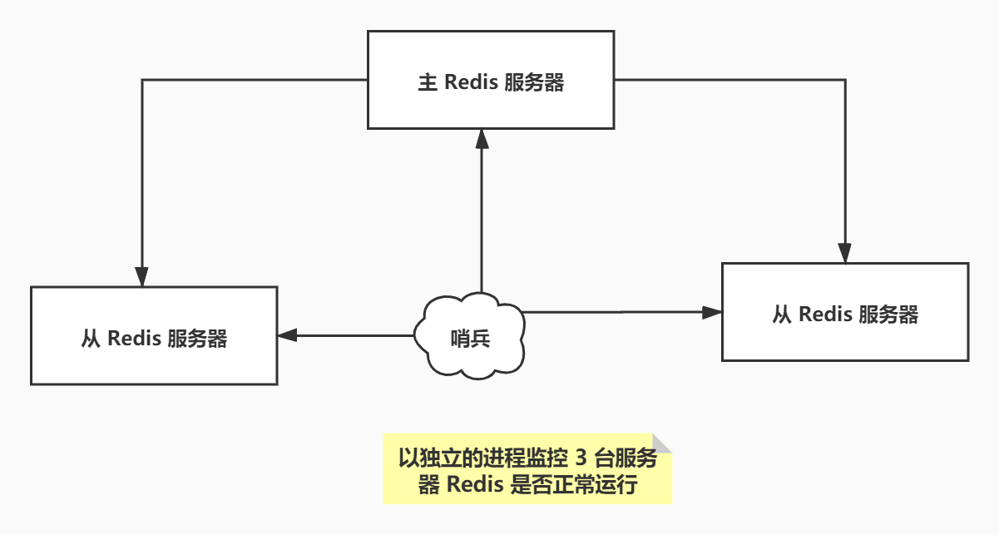
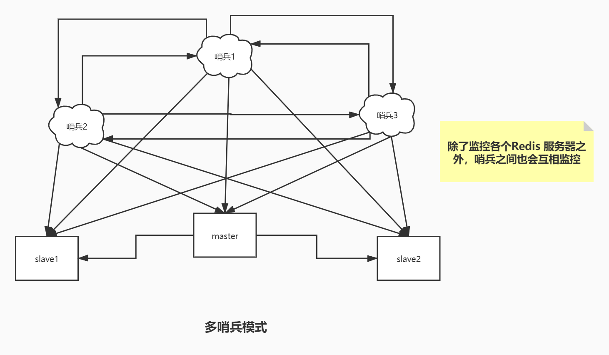

# 5. 发布订阅模式、主从复制和哨兵模式

## 5.1 Redis 订阅发布

Redis 发布订阅（pub/sub）是一种消息通信模式：发送者发（pub）送消息，订阅者(sub)接收消息。

Redis 客户端可以订阅任意数量的频道。

订阅 / 发布消息图：



下图展示了频道 channel1，已经订阅这个频道的三个客户端。



当有新消息通过 publish 命令发送给频道 channel1 时，这个消息就会被发送给订阅它的三个客户端。

> 命令

这些命令被广泛应用于构建即时通讯应用、比如网络聊天室和实时广播、实时提醒等。

| 序号 | 命令及描述                                                   |
| :--- | :----------------------------------------------------------- |
| 1    | [PSUBSCRIBE pattern [pattern ...\]](https://www.runoob.com/redis/pub-sub-psubscribe.html) 订阅一个或多个符合给定模式的频道。 |
| 2    | [PUBSUB subcommand [argument [argument ...\]]](https://www.runoob.com/redis/pub-sub-pubsub.html) 查看订阅与发布系统状态。 |
| 3    | [PUBLISH channel message](https://www.runoob.com/redis/pub-sub-publish.html) 将信息发送到指定的频道。 |
| 4    | [PUNSUBSCRIBE [pattern [pattern ...\]]](https://www.runoob.com/redis/pub-sub-punsubscribe.html) 退订所有给定模式的频道。 |
| 5    | [SUBSCRIBE channel [channel ...\]](https://www.runoob.com/redis/pub-sub-subscribe.html) 订阅给定的一个或多个频道的信息。 |
| 6    | [UNSUBSCRIBE [channel [channel ...\]]](https://www.runoob.com/redis/pub-sub-unsubscribe.html) 指退订给定的频道。 |

> 测试

以下实例演示了发布订阅是如何工作的。在我们实例中我们创建了订阅频道名为 **redisChat**:

```bash
redis 127.0.0.1:6379> SUBSCRIBE redisChat

Reading messages... (press Ctrl-C to quit)
1) "subscribe"
2) "redisChat"
3) (integer) 1
```

现在，我们先重新开启个 redis 客户端，然后在同一个频道 redisChat 发布两次消息，订阅者就能接收到消息。

```bash
redis 127.0.0.1:6379> PUBLISH redisChat "Redis is a great caching technique"

(integer) 1

redis 127.0.0.1:6379> PUBLISH redisChat "Learn redis by mszlu.com"

(integer) 1

# 订阅者的客户端会显示如下消息
1) "message"
2) "redisChat"
3) "Redis is a great caching technique"
1) "message"
2) "redisChat"
3) "Learn redis by mszlu.com"
```

> 原理

Redis 是使用 C 实现的，通过分析 Redis 源码里的 public.c 文件，了解发布和订阅机制的底层实现，借此加深对 Redis 的理解。Redis 通过 public 、subscribe 和 psubscribe 等命令实现发布和订阅功能。


**使用场景：**

1、实时消息系统

2、实时聊天

3、订阅、关注系统都可以

稍微复杂的场景更多的使用消息中间件 MQ。

## 5.2 主从复制

### 5.2.1 概念

主从复制，是指将一台 Redis 服务器的数据，复制到其他的 Redis 服务器。前者称之为主节点（master/leader），后者称之为从节点（slave/flower）；数据的复制都是单向的，只能从主节点到从节点。Master 以写为主，Slave 以读为主。

默认情况下，每台 Redis 服务器都是主节点。且一个主节点可以有多个从节点或者没有从节点，但是一个从节点只能有一个主节点。

### 5.2.2 主从复制的作用

1、数据冗余：主从复制实现了数据的热备份，是持久化的之外的一种数据冗余方式。

2、故障恢复：当主节点出现问题时，可以由从节点提供服务，实现快速的故障恢复。实际也是一种服务的冗余。

3、负载均衡：在主从复制的基础上，配合读写分离，可以由主节点提供写服务，由从节点提供读服务（即写 Redis 数据时应用连接主节点，读 Redis 的时候应用连接从节点），分担服务器负载；尤其是在写少读多的场景下，通过多个节点分担读负载，可以大大提高 Redis 服务器的并发量。

4、高可用（集群）的基石：除了上述作用以外，主从复制还是哨兵模式和集群能够实施的基础，因此说主从复制是 Redis 高可用的基础。

一般来说，要将Redis 运用于工程项目中，只使用一台 Redis 是万万不能的（可能会宕机），原因如下：

1、从结构上，单个 Redis 服务器会发生单点故障，并且一台服务器需要处理所有的请求负载，压力很大；

2、从容量上，单个 Redis 服务器内存容量有限，就算一台 Redis 服务器内存容量为 256G， 也不能将所有的内存用作 Redis 存储内存，一般来说，**单台 Redis最大使用内存不应该超过 20G**。

电商网站上的商品，一般都是一次上传，无数次浏览的，说专业点就是“读多写少”。

对于这种场景，我们可以使用如下这种架构：



主从复制，读写分离！80% 的情况下，都是在进行读操作。这种架构可以减少服务器压力，经常使用实际生产环境中，最少是“一主二从”的配置。真实环境中不可能使用单机 Redis。

### 5.2.3 环境配置

只配置从库，不用配置主库。

```bash
[root@coder bin]# redis-cli -p 6379
127.0.0.1:6379> ping
PONG
127.0.0.1:6379> info replication			# 查看当前库的信息
# Replication
role:master									# 角色
connected_slaves:0							# 当前没有从库
master_replid:2467dd9bd1c252ce80df280c925187b3417055ad
master_replid2:0000000000000000000000000000000000000000
master_repl_offset:0
second_repl_offset:-1
repl_backlog_active:0
repl_backlog_size:1048576
repl_backlog_first_byte_offset:0
repl_backlog_histlen:0
127.0.0.1:6379> 
```

复制 3 个配置文件，然后修改对应的信息

1、端口

2、pid 名称

3、log 文件名称

4、dump.rdb 名称

```shell
port 6381
pidfile /var/run/redis_6381.pid
logfile "6381.log"
dbfilename dump6381.rdb
```

修改完毕后，启动我们的 3 个 redis 服务器，可以通过进程信息查询。

```bash
[root@coder ~]# ps -ef|grep redis
root       426     1  0 16:53 ?        00:00:00 redis-server *:6379
root       446     1  0 16:54 ?        00:00:00 redis-server *:6380
root       457     1  0 16:54 ?        00:00:00 redis-server *:6381
root       464   304  0 16:54 pts/3    00:00:00 grep --color=auto redis
```

### 5.2.4 一主二从

默认情况下，每台 Redis 服务器都是主节点，我们一般情况下，只用配置从机就好了。

主机：6379， 从机：6380 和 6381

配置的方式有两种：一种是直接使用命令配置，这种方式当 Redis 重启后配置会失效。另一种方式是使用配置文件。这里使用命令演示一下。

下面将80 和 81 两个配置为在从机。

```bash
127.0.0.1:6380> SLAVEOF 127.0.0.1 6379		# SLAVEOF host  port
OK
127.0.0.1:6380> info replication
# Replication
role:slave			# 角色已经是从机了
master_host:127.0.0.1	# 主节点地址
master_port:6379			# 主节点端口
master_link_status:up
master_last_io_seconds_ago:6
master_sync_in_progress:0
slave_repl_offset:0
slave_priority:100
slave_read_only:1
connected_slaves:0
master_replid:907bcdf00c69d361ede43f4f6181004e2148efb7
master_replid2:0000000000000000000000000000000000000000
master_repl_offset:0
second_repl_offset:-1
repl_backlog_active:1
repl_backlog_size:1048576
repl_backlog_first_byte_offset:1
repl_backlog_histlen:0
127.0.0.1:6380> 
```

配置好了之后，看主机：

```bash
127.0.0.1:6379> info replication
# Replication
role:master
connected_slaves:2		# 主节点下有两个从节点
slave0:ip=127.0.0.1,port=6380,state=online,offset=420,lag=1
slave1:ip=127.0.0.1,port=6381,state=online,offset=420,lag=1
master_replid:907bcdf00c69d361ede43f4f6181004e2148efb7
master_replid2:0000000000000000000000000000000000000000
master_repl_offset:420
second_repl_offset:-1
repl_backlog_active:1
repl_backlog_size:1048576
repl_backlog_first_byte_offset:1
repl_backlog_histlen:420
127.0.0.1:6379> 
```

真实的主从配置应该是在配置文件中配置，这样才是永久的。这里使用命令是暂时的。

配置文件 redis.conf

```bash
################################# REPLICATION #################################

# Master-Replica replication. Use replicaof to make a Redis instance a copy of
# another Redis server. A few things to understand ASAP about Redis replication.
#
#   +------------------+      +---------------+
#   |      Master      | ---> |    Replica    |
#   | (receive writes) |      |  (exact copy) |
#   +------------------+      +---------------+
#
# 1) Redis replication is asynchronous, but you can configure a master to
#    stop accepting writes if it appears to be not connected with at least
#    a given number of replicas.
# 2) Redis replicas are able to perform a partial resynchronization with the
#    master if the replication link is lost for a relatively small amount of
#    time. You may want to configure the replication backlog size (see the next
#    sections of this file) with a sensible value depending on your needs.
# 3) Replication is automatic and does not need user intervention. After a
#    network partition replicas automatically try to reconnect to masters
#    and resynchronize with them.
#
# replicaof <masterip> <masterport>			# 这里配置

# If the master is password protected (using the "requirepass" configuration
# directive below) it is possible to tell the replica to authenticate before
# starting the replication synchronization process, otherwise the master will
# refuse the replica request.
#
# masterauth <master-password>
```

配置方式也是一样的。

### 5.2.5 几个问题

1、主机可以写，从机不能写只能读。主机中的所有信息和数据都会保存在从机中。如果从机尝试进行写操作就会报错。

```bash
127.0.0.1:6381> get k1			# k1的值是在主机中写入的，从机中可以读取到。
"v1"
127.0.0.1:6381> set k2 v2			# 从机尝试写操作，报错了
(error) READONLY You can't write against a read only replica.
127.0.0.1:6381> 
```

2、如果主机断开了，从机依然链接到主机，可以进行读操作，但是还是没有写操作。这个时候，主机如果恢复了，从机依然可以直接从主机同步信息。

3、使用命令行配置的主从机，如果从机重启了，就会变回主机。如果再通过命令变回从机的话，立马就可以从主机中获取值。这是复制原理决定的。

### 5.2.6 复制原理

**Slave 启动成功连接到 Master 后会发送一个 sync 同步命令。**

Master 接收到命令后，启动后台的存盘进程，同时收集所有接收到的用于修改数据集的命令，在后台进程执行完毕后，master 将传送整个数据文件到 slave ，并完成一次完全同步。

同步的数据 使用的是RDB文件，收到同步命令之后，master会bgsave 把数据保存在rdb中，发送给从机。

bgsave：fork出来一个子进程 进行处理，不影响主进程的使用。

**全量复制：**Slave 服务在接收到数据库文件后，将其存盘并加载到内存中。

**增量复制：** Master 继续将新的所有收集到的修改命令一次传给 slave，完成同步。

但是只要重新连接 master ，一次完全同步（全量复制）将被自动执行。我们的数据一定可以在从机中看到。

这种模式的原理图：



### 第二种模式



这种模式的话，将 6381 的主节点配置为 6380 。主节点 6379 只有一个从机。

如果现在 6379 节点宕机了， 6380 和 6381 节点都是从节点，只能进行读操作，都不会自动变为主节点。需要手动将其中一个变为主节点，使用如下命令：

```bash
SLAVEOF no one
```

## 5.3 哨兵模式

### 5.3.1 概述

主从切换技术的方式是：当主机服务器宕机之后，需要手动将一台服务器切换为主服务器，这需要人工干预，费时费力，还会造成一段时间内的服务不可用。这不是一种推荐的方式，更多的时候我们优先考虑的的是哨兵模式。Redis 从 2.8 开始正式提供了 Sentinel（哨兵）架构来解决这个问题。

哨兵模式能够后台监控主机是否故障，如果故障了根据投票数（投哨兵节点）自动将从库转换为主库。

当有多个哨兵节点的时候，需要选出一个哨兵节点 来去进行主从切换。

哨兵模式是一种特殊的模式，首先 Redis 提供了哨兵的命令，哨兵是一个独立的进程，作为进程，它独立运行。其原理是**哨兵通过发送命令，等待 Redis 服务器响应，从而监控运行的多个 Redis 实例**。



这里的哨兵有两个作用

- 通过发送命令，让 Redis 服务器返回监控其运行状态，包括主服务器和从服务器
- 当哨兵检测到 master 宕机，会自动将 slave 切换为 master，然后通过发布订阅模式通知其他的从放服务器，修改配置文件，让他们切换主机。

然而一个哨兵进程对 Redis 服务器进行监控，可能会出现问题，为此，我们可以使用多个哨兵进行监控。各个哨兵之间还会进行监控，这样就形成了多哨兵模式。



假设主服务器宕机了，哨兵1先检测到这个结果，系统并不会马上进行 failover 过程，仅仅是哨兵 1 主观认为主服务器不可用，这个现象称之为**主观下线**。当后面的哨兵也检测到主服务器不可用，并且数量达到一定值时，这个过程称之为**客观下线**，那么哨兵之间就会进行一次投票，投票的结果由一个哨兵发起，最终会选出来一个leader（哨兵节点），进行 failover 【故障转移】。切换成功后，就会通过发布订阅模式，让各个哨兵把自己监控的从服务器实现切换主从切换。

### 5.3.2 配置一个一主两从的哨兵模式

1、配置哨兵模式配置文件，新建文件 `/usr/local/bin/redis-config/sentinel.conf`。

```bash
# sentinel monitor 被监控的名字（随便写） host 1
sentinel monitor myredis 127.0.0.1 1
```

后面的数字1代表主机宕机后，slave投票决定谁成为新的主机，票数最多成为主机。

2、启动哨兵

```bash
[root@coder bin]# ls
6379.log  6381.log      dump6380.rdb  dump.rdb  redis-benchmark  redis-check-rdb  redis-sentinel
6380.log  dump6379.rdb  dump6381.rdb  redis-config   redis-check-aof  redis-cli        redis-server
[root@coder bin]# redis-sentinel redis-config/sentinel.conf 
2421:X 15 May 2020 20:24:06.847 # oO0OoO0OoO0Oo Redis is starting oO0OoO0OoO0Oo
2421:X 15 May 2020 20:24:06.847 # Redis version=5.0.5, bits=64, commit=00000000, modified=0, pid=2421, just started
2421:X 15 May 2020 20:24:06.847 # Configuration loaded
                _._                                                  
           _.-``__ ''-._                                             
      _.-``    `.  `_.  ''-._           Redis 5.0.5 (00000000/0) 64 bit
  .-`` .-```.  ```\/    _.,_ ''-._                                   
 (    '      ,       .-`  | `,    )     Running in sentinel mode
 |`-._`-...-` __...-.``-._|'` _.-'|     Port: 26379
 |    `-._   `._    /     _.-'    |     PID: 2421
  `-._    `-._  `-./  _.-'    _.-'                                   
 |`-._`-._    `-.__.-'    _.-'_.-'|                                  
 |    `-._`-._        _.-'_.-'    |           http://redis.io        
  `-._    `-._`-.__.-'_.-'    _.-'                                   
 |`-._`-._    `-.__.-'    _.-'_.-'|                                  
 |    `-._`-._        _.-'_.-'    |                                  
  `-._    `-._`-.__.-'_.-'    _.-'                                   
      `-._    `-.__.-'    _.-'                                       
          `-._        _.-'                                           
              `-.__.-'                                               

2421:X 15 May 2020 20:24:06.848 # WARNING: The TCP backlog setting of 511 cannot be enforced because /proc/sys/net/core/somaxconn is set to the lower value of 128.
2421:X 15 May 2020 20:24:06.851 # Sentinel ID is 100430af0018d23bd1ae2fe57e71e0d45f64d9a5
2421:X 15 May 2020 20:24:06.851 # +monitor master myredis 127.0.0.1 6379 quorum 1
2421:X 15 May 2020 20:24:06.852 * +slave slave 127.0.0.1:6381 127.0.0.1 6381 @ myredis 127.0.0.1 6379
```

启动成功~！

如果现在 Master 节点宕机了，这个时候会从从机中根据投票算法选择一个作为主机。

如果原来的主机恢复运行了，只能归到新的主机下，作为从机， 这就是哨兵模式的规则。

> 哨兵模式的优点

1、哨兵集群，基于主从复制模式，所有的主从配置优点，它全有

2、主从可以切换，故障可以转移，系统的可用性就会更好

3、哨兵模式就是主从模式的升级，手动到自动，更加健壮。

> 哨兵模式的缺点

1、Redis 不方便在线扩容，集群达到一定的上限，在线扩容就会十分麻烦；

2、实现哨兵模式的配置其实也很麻烦，里面有甚多的配置项。