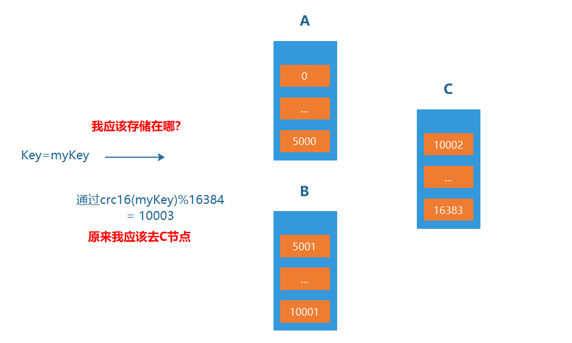

# Redis集群

随着业务系统功能、模块、规模、复杂性的增加，我们对Redis的要求越来越高，尤其是在高低峰场景的动态伸缩能力，比如：电商平台平日流量较低且平稳，双十一大促流量是平日的数倍，两种情况下对于各系统的数量要求必然不同。如果始终配备高峰时的硬件及中间件配置，必然带来大量的资源浪费。

Redis作为业界优秀的缓存产品，成为了各类系统的必备中间件。哨兵模式虽然优秀，但由于其不具备动态水平伸缩能力，无法满足日益复杂的应用场景。在官方推出集群模式之前，业界就已经推出了各种优秀实践，比如：Codis、twemproxy等。

为了弥补这一缺陷，自3.0版本起，Redis官方推出了一种新的运行模式——Redis Cluster。

Redis Cluster采用无中心结构，具备多个节点之间自动进行数据分片的能力，支持节点动态添加与移除，可以在部分节点不可用时进行自动故障转移，确保系统高可用的一种集群化运行模式。按照官方的阐述，Redis Cluster有以下设计目标：

- 高性能可扩展，支持扩展到1000个节点。多个节点之间数据分片，采用异步复制模式完成主从同步，无代理方式完成重定向。
- 一定程度内可接受的写入安全：系统将尽可能去保留客户端通过大多数主节点所在网络分区所有的写入操作，通常情况下存在写入命令已确认却丢失的较短时间窗口。如果客户端连接至少量节点所处的网络分区，这个时间窗口可能较大。
- 可用性：如果大多数节点是可达的，并且不可达主节点至少存在一个可达的从节点，那么Redis Cluster可以在网络分区下工作。而且，如果某个主节点A无从节点，但是某些主节点B拥有多个（大于1）从节点，可以通过从节点迁移操作，把B的某个从节点转移至A。

简单概述。结合以上三个目标，我认为Redis Cluster最大的特点在于可扩展性，多个主节点通过分片机制存储所有数据，即每个主从复制结构单元管理部分key。

因为在主从复制、哨兵模式下，同样具备其他优点。

当系统容量足够大时，读请求可以通过增加从节点进行分摊压力，但是写请求只能通过主节点，这样存在以下风险点：

- 所有写入请求集中在一个Redis实例，随着请求的增加，单个主节点可能出现写入延迟。
- 每个节点都保存系统的全量数据，如果存储数据过多，执行rdb备份或aof重写时fork耗时增加，主从复制传输及数据恢复耗时增加，甚至失败；
- 如果该主节点故障，在故障转移期间可能导致所有服务短时的数据丢失或不可用。

所以，动态伸缩能力是Redis Cluster最耀眼的特色。

# 1. 哈希槽

Redis-cluster引入了**哈希槽**的概念。

Redis-cluster中有16384(即2的14次方）个哈希槽，每个key通过CRC16校验后对16384取模来决定放置哪个槽。

Cluster中的每个节点负责一部分hash槽（hash slot）。

比如集群中存在三个节点，则可能存在的一种分配如下：

- 节点A包含0到5500号哈希槽；
- 节点B包含5501到11000号哈希槽；
- 节点C包含11001 到 16383号哈希槽。




# 2. 请求重定向

Redis cluster采用去中心化的架构，集群的主节点各自负责一部分槽，客户端如何确定key到底会映射到哪个节点上呢？这就是我们要讲的请求重定向。


在cluster模式下，**节点对请求的处理过程**如下：

- 检查当前key是否存在当前NODE？
  - 通过crc16（key）/16384计算出slot
  - 查询负责该slot负责的节点，得到节点指针
  - 该指针与自身节点比较
- 若slot不是由自身负责，则返回MOVED重定向
- 若slot由自身负责，且key在slot中，则返回该key对应结果
- 若key不存在此slot中，检查该slot是否正在迁出（MIGRATING）？
- 若key正在迁出，返回ASK错误重定向客户端到迁移的目的服务器上
- 若Slot未迁出，检查Slot是否导入中？
- 若Slot导入中且有ASKING标记，则直接操作
- 否则返回MOVED重定向

move重定向：


- 槽命中：直接返回结果
- 槽不命中：即当前键命令所请求的键不在当前请求的节点中，则当前节点会向客户端发送一个Moved 重定向，客户端根据Moved 重定向所包含的内容找到目标节点，再一次发送命令。

ASK 重定向：

Ask重定向发生于集群伸缩时，集群伸缩会导致槽迁移，当我们去源节点访问时，此时数据已经可能已经迁移到了目标节点，使用Ask重定向来解决此种情况


# 3. Cluster集群结构搭建

**搭建方式**

1.	配置服务器（3主3从）
  	2.	建立通信（Meet）
  	3.	分槽（Slot）
  	4.	搭建主从（master-slave）


**Cluster配置：**

1. 是否启用cluster，加入cluster节点

   ```properties
   cluster-enabled yes|no
   ```

   

2. cluster配置文件名，该文件属于自动生成，仅用于快速查找文件并查询文件内容

   ```properties
   cluster-config-file filename
   ```

   

3. 节点服务响应超时时间，用于判定该节点是否下线或切换为从节点

   ```properties
   cluster-node-timeout milliseconds
   ```

   

4. master连接的slave最小数量

```properties
cluster-migration-barrier min_slave_number
```

**Cluster节点操作命令:**

1. 查看集群节点信息

   ```properties
   cluster nodes
   ```

   

2. 更改slave指向新的master

   ```properties
   cluster replicate master-id
   ```

   

3. 发现一个新节点，新增master

   ```properties
   cluster meet ip:port
   
   ```

   

4. 忽略一个没有solt的节点

   ```properties
   cluster forget server_id
   ```

   

5. 手动故障转移

   ```properties
   cluster failover
   ```

   

**redis-cli命令**

1. 创建集群

   ```properties
   redis-cli –-cluster create masterhost1:masterport1 masterhost2:masterport2
   masterhost3:masterport3 [masterhostn:masterportn …] slavehost1:slaveport1
   slavehost2:slaveport2 slavehost3:slaveport3 ––cluster-replicas n
   ```

   master与slave的数量要匹配，一个master对应n个slave，由最后的参数n决定

   master与slave的匹配顺序为第一个master与前n个slave分为一组，形成主从结构

   

2. 添加master到当前集群中，连接时可以指定任意现有节点地址与端口

   ```properties
   redis-cli --cluster add-node new-master-host:new-master-port now-host:now-port
   ```

   

3. 添加slave

   ```properties
   redis-cli --cluster add-node new-slave-host:new-slave-port
   master-host:master-port --cluster-slave --cluster-master-id masterid
   ```

   

4. 删除节点，如果删除的节点是master，必须保障其中没有槽slot

   ```properties
   redis-cli --cluster del-node del-slave-host:del-slave-port del-slave-id
   ```

   

5. 重新分槽，分槽是从具有槽的master中划分一部分给其他master，过程中不创建新的槽

   ```properties
   redis-cli --cluster reshard new-master-host:new-master:port --cluster-from srcmaster-id1, src-master-id2, src-master-idn --cluster-to target-master-id --cluster-slots slots
   ```

将需要参与分槽的所有masterid不分先后顺序添加到参数中，使用，分隔

指定目标得到的槽的数量，所有的槽将平均从每个来源的master处获取

6. 重新分配槽，从具有槽的master中分配指定数量的槽到另一个master中，常用于清空指定master中的槽

   ```properties
   redis-cli --cluster reshard src-master-host:src-master-port --cluster-from srcmaster-id --cluster-to target-master-id --cluster-slots slots --cluster-yes 
   ```

