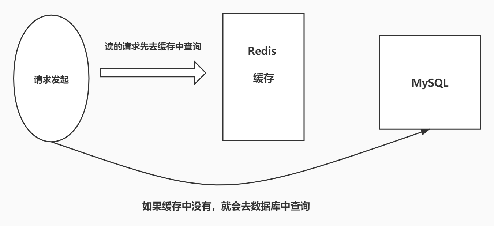
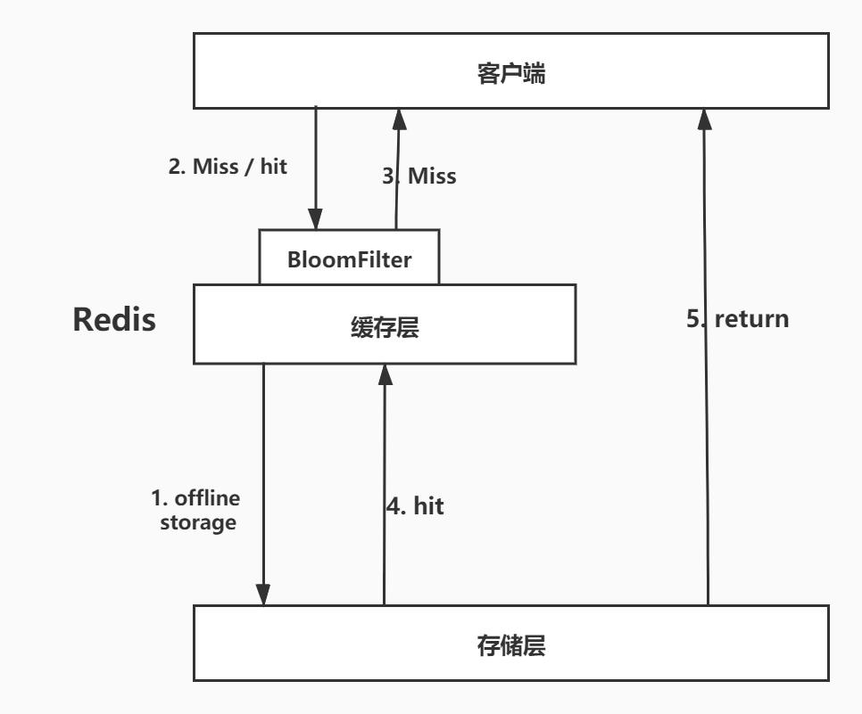
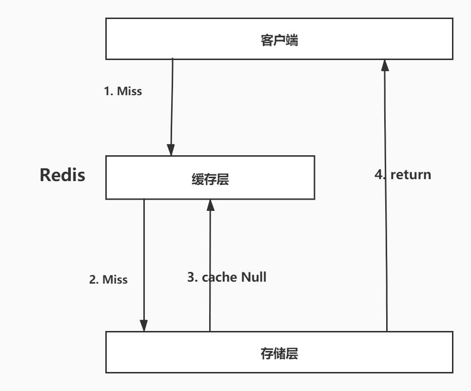
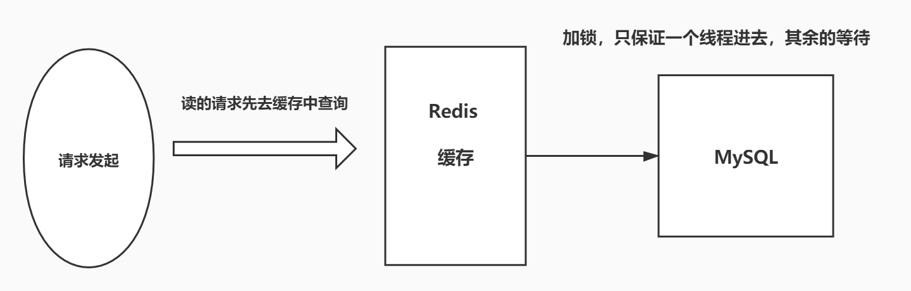
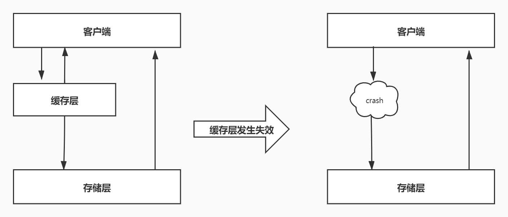

# 7. Redis的缓存穿透、缓存击穿和缓存雪崩

## 7.1 Redis可能的问题

Redis 缓存的使用，极大的提升了应用程序的性能和效率，特别是数据查询方面。但同时，它也带了一些问题。其中，最要害的是问题，就是数据一致性的问题，从严格意义上讲，这个问题无解。如果对数据的一致性要求很高，那么久不能使用缓存。

另外一些典型的问题就是，缓存穿透、缓存雪崩缓存击穿，目前，是业界也都有比较流行的解决方案。

## 7.2 缓存穿透（查不到数据导致）

缓存穿透的概念简单，用户想要查询一个数据，发现 Redis 内存数据库没有，也就是缓存没有命中。于是向持久层数据库查询。发现也没有，于是本次查询失败。当用户很多的时候，缓存都没有命中，于是都去请求了持久层数据库。这给持久层数据库造成很大的压力，这时候就相当于出现了缓存穿透。

> 解决方案：布隆过滤器

### 7.2.1 布隆过滤器

布隆过滤器是一种数据结构，对所有可能查询的参数以 hash 形式存储，在控制层先进行校验，不符合则丢弃，从而避免了对底层存储系统的查询压力。

### 7.2.2 缓存空对象

当存储层不命中后，即使返回的空对象也将其缓存起来，同步会同步一个过期时间，之后再访问这个数据将会从存储中获取，保护了后端数据源。

但是这种方法会存在两个问题：

1、如果控制能够被缓存起来，这就意味着缓存需要更多的空间存储，因为这当中可能会有很多的空值的键；

2、即使对空值设置了过期时间，还是会存在缓存层和存储层的数据会有一段时间窗口的不一致，这对于需要保持一致性的业务会有影响。

## 7.3 缓存击穿（请求太多，缓存过期）

这里需要注意和缓存穿透的区别。缓存击穿，是指一个 key 非常热点，在不停的扛着大并发，大并发集中对这一个点进行访问，当这个 key 在失效的瞬间，持续的大并发就穿破缓存，直接请求数据库，就像在一个屏障上凿开了一个洞。

当某个 key 在过期的瞬间，有大量的请求并发访问，这类数据一般是热点数据，由于缓存过期，会同时访问数据库来查询最新的数据，并回写缓存，会导致数据库瞬间压力过大。

> 解决方案：

### 7.3.1 设置热点数据永不过期

从缓存层来看，没有设置过期时间，所以不会出现热点 key 过期后产生的问题。

### 7.3.2 加互斥锁

分布式锁：使用分布式锁，保证对于每个 key 同时只有一个线程去查询后端服务，其他线程没有获得分布式锁的权限，因此只需要等待即可。这种方式将高并发的压力转移到了分布式锁，因对分布式锁的考验很大。

### 

## 7.4 缓存雪崩

缓存雪崩，是指在某一个时间段，缓存集中过期失效。

产生雪崩的原因之一，比如马上就要双十二零点，，很快就会有一波抢购，这波商品时间比较集中的放在了缓存，假设缓存一个小时。那么到了凌晨一点钟的时候，这批商品的缓存就都会过期了。而对这批商品的访问查询，都落到数据库上，对于数据库而言，就会产生周期性的压力波峰。于是所有的请求都会到达存储层，存储层的调用量会暴增，造成存储层也回掉的情况。

其实集中时期，倒不是非常致命，比较致命的缓存雪崩，是缓存服务器某个节点宕机或者断网。因为自然形成 的缓存雪崩，一定是某个时间段中创建缓存，这个时候也是可以顶住压力的。无非就是对数据库产生周期性的压力而已。而缓存服务节点的宕机，对于数据库服务器的压力是不可预的，很有可能瞬间就把数据库压垮。

> 解决方案

### 7.4.1 Redis 高可用

这个思想的含义是，既然 redis 有可能挂掉，那我多增设几台 redis，这样一台挂掉之后其他的还可以继续工作，其实就是搭建的集群

### 7.4.2 限流降级

这个解决方案的思想是，在缓存失效后，通过加锁或者队列来控制数据库写缓存的线程数量。比如对某个 key 只允许一个线程查询数据和写缓存，其他线程等待。

### 7.4.3 数据预热

数据预热的含义是在正式部署之前，把可能的数据线预先访问一遍，这样部分可能大量访问的数据就会加载到缓存。在即将发生大并发访问前手动触发加载缓存不同的key，设置不同的过期时间，让缓存失效的时间点尽量均匀。